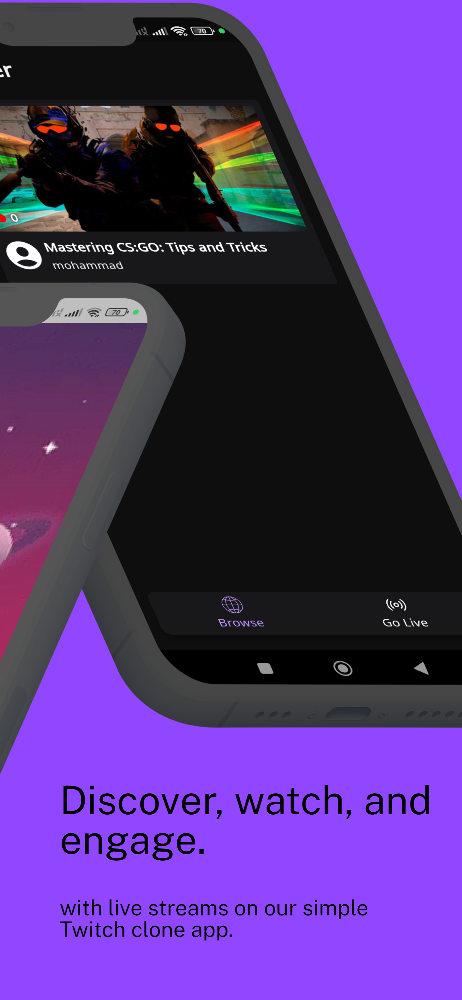
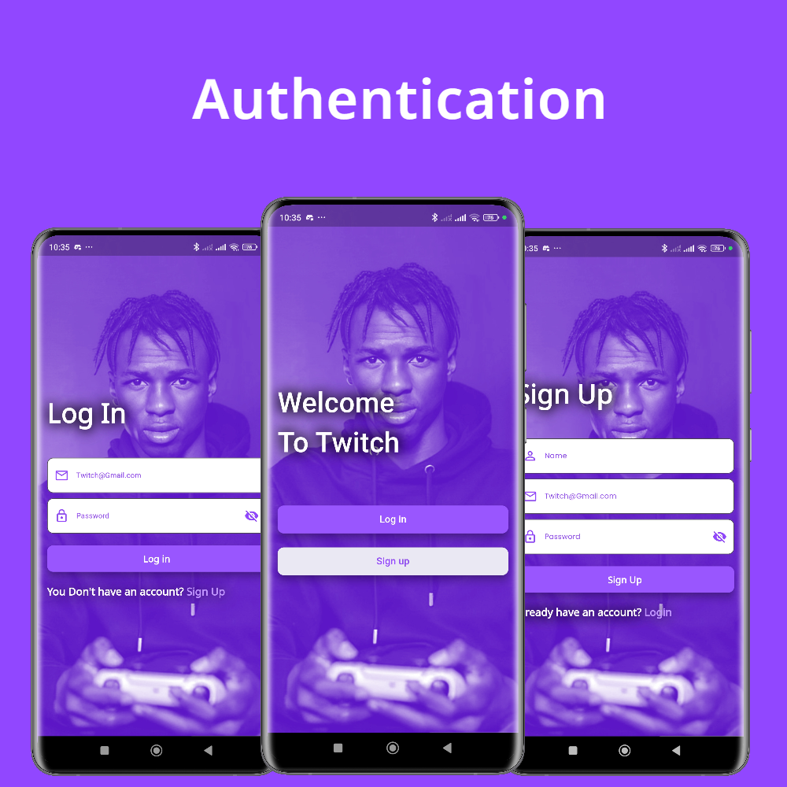
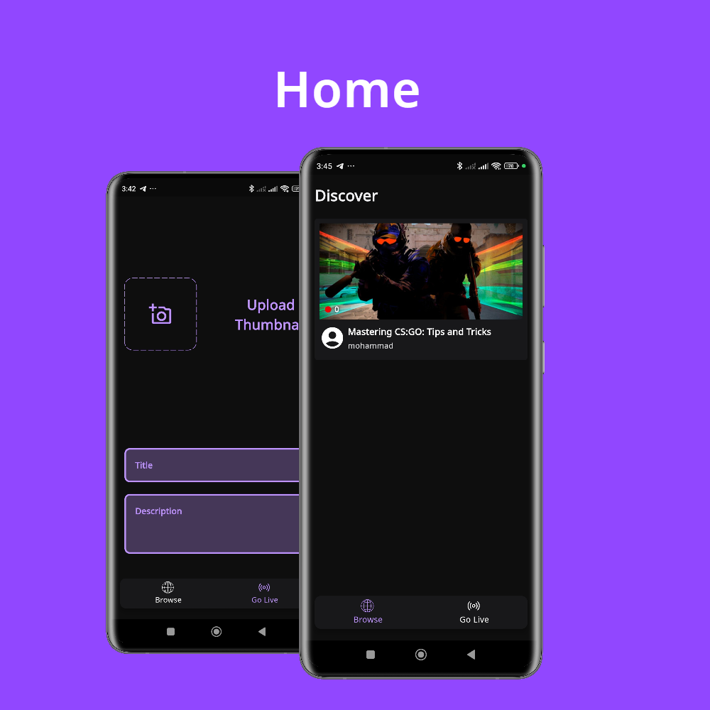
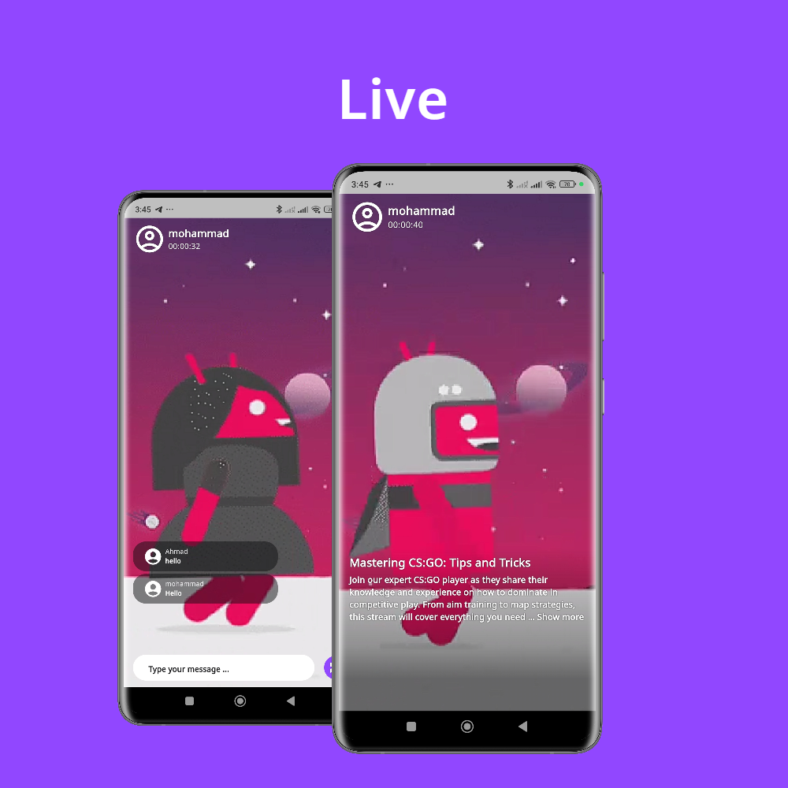

<h1>Twitch Clone</h1>

Experience the excitement of live streaming on our user-friendly Twitch clone app. Explore a diverse selection of streams from gaming to music, art, and more. Engage with talented content creators and connect with like-minded viewers in a vibrant community. Download now and immerse yourself in the world of live streaming anytime, anywhere.

# :star2: Screenshots

 
  

 
  

 
  

### :dart: Features
- Authentication: Securely log in to the app using Firebase Authentication for enhanced account security and personalized user experiences.
- Browse Live Stream: Explore a wide variety of live streams across different categories. Easily find and join live streams that interest you.
- Go Live: Start your own live stream and share your content with the world. Engage with your audience in real-time.
- Live Chat: Interact with the live streamer and other viewers through a real-time chat feature.
